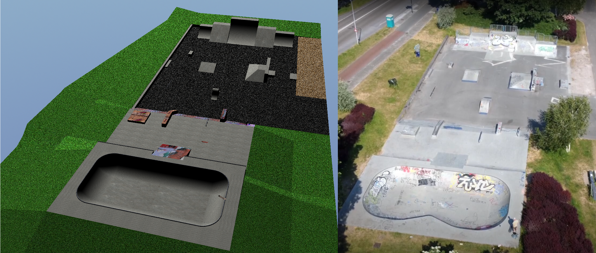

# Skatepark
This project was build with OpenGL and C++ from scratch using the freeglut, glew and glm libraries. Only the skateboard model was imported and made with Blender(Not a masterpiece). Meaning that all other shapes were made by using a Cube, Prism, Cylinder, Sphere, Torus or a combination of those models. These models were made by calculating the needed vertices, normals and uv's. It doesn't seem like much but that was a tedious and insightfull task.

[Video](https://www.youtube.com/watch?v=NPlIVm7E-7w)

# Controls
*Movement:* {Up}, {Down}, {Left}, {Right}, {PageUp}, {PageDown} or {W}, {S}, {A}, {D}, {Q}, {E}

*Mouse:* Drag and drop to move view

*Switch between ground/aerial view:* V

*Reset both views to start positions:* C
